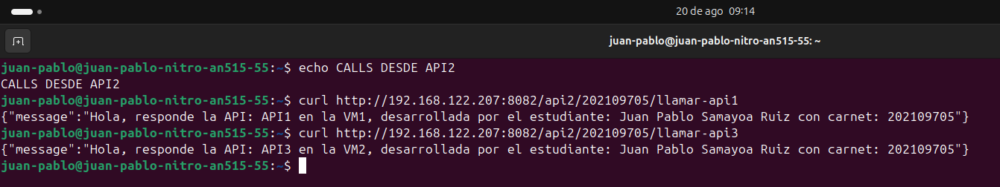

# 202109705_LAB_SO1_2S2025

<div align="center">


</div>

## 1. Guia de instalación

### 1.1 Instalación de hipervisor KVM

**Verificaciones previas**:

1. Actualizar dependecias del sitema operativo en el que esté realizando la virtualización (en este caso Ubuntu) con el comando:

```bash
sudo apt update
```

2. Verificar que el CPU permita la virtualización
3. Habilitar VMX/SVM desde la BIOS de la computadora en el apartado de ADVANCE
4. Comprobar si la virtualización ha sido activada exitosamente ingresando el siguiente comando:

```bash
egrep  -c '(vmx|vms)' /proc/cpuinfo
```

Si el comando devuelve un número diferente de 0 significa que la virtualización es posible.

5. De igual forma es recomendable instalar un checker de CPU con el siguiente comando:

```bash
sudo apt install cpu-checker -y
```

Esta herramienta ayuda a verificar si se te permite realizar maquinas virtuales utilizando maquinas virtuales a base del kernel (KVM)

6. Ingresar el siguienete comando para verificar si se tiene soporte para KVM y si este se encuentra habilitado

```bash
kvm-ok

la respuesta debe ser similar a la siguiente:

INFO: /dev/kvm exists
KVM acceleration can be used
```

**Instalación Qemu-KVM**

7. Proceder a la sintalación de Qemu-KVM

```bash
sudo apt install -y qemu-kvm virt-manager libvirt-daemon-system virtinst libvirt-clients bridge-utils
```

Una vez realizado esto el sistema estará listo para la virtualización

8. Habilitar e iniciar los servicios de libvirt

```bash
echo Asegura que el servicio se incia cada vez que se bootea la computadora
sudo sytemctl enable --now libvirtd

echo inicia el servicio de libvirtd
sudo sytemctl start libvirtd

echo verificar el estado del servicio (debe indicar activo y corriendo)
sudo systemctl status libvirtd
```

9. Crear grupos de usuario para KVM y libvirt (De esta forma se evita escribir el comando sudo cada vez que se tenga que realizar una operación con estas herramientas)

```bash
sudo usermod -aG kvm $USER
sudo usermod -aG libvirt $USER
```

Una vez realizados todos estos pasos ya se puede proceder con la creación y configuración de las maquinar virtuales

## 1.2 Creación Maquinas virtuales 

1. Descargar la imagen de ubuntu server desde la pagina oficila de ubuntu o haciendo click en el siguiente enlace:

[Descargar Ubuntu Server](https://ubuntu.com/download/server)

2. Ingresar a la herramienta visual de Gestor de Maquinas virtuales y crear una nueva maquina virtual y seleccionar la imagen ISO descargada anteriormente para poder usar la maquina virtual con Ubuntu server

3. Asignar recursos a las maquinar virtuales, a continuación se tiene una tabla con los recursos asignados para la elaboración de este proyecto (Nota: En este caso los recurso pueden variar dependiendo de la disposición que tenga la maquina HOST)

<div align="center">

| VM | Tipo de red | RAM | Nucleos del CPU | Almacenamiento |
|:--:|:-----------:|:---:|:---------------:|:--------------:|
|VM1 | RED NAT (default)| 2 GB | 2 | 7 GB |
|VM2 | RED NAT (default)| 2 GB | 2 | 7 GB |
|VM3 | RED NAT (default)| 2 GB | 2 | 10 GB |

</div>

Una vez realizado esto ya se puede proceder a la creación de la maquina virtual

4. Inciar la maquina virtual y configurar UBUNTU server, a continuación se deja una tabla con los datos ingresados para la configuración de UBUNTU server

<div align="center">

| VM | Usuario | Contraseña |
|:--:|:-----------:|:---:|
|VM1 | sopes1vm1|SOPES1VM1|
|VM2 | sopes1vm1|SOPES1VM2|
|VM3 | sopes1vm1|SOPES1VM3|

</div>

5. Reinciar las VM e ingresar a UBUNTU server para descargar las herramientas necesarias

### 1.2.1 Configuración VM1 y VM2

1. Actualizar los paquetes del sistema
```bash
sudo apt update && sudo apt upgrade -y
```

2. Instalar Containerd y configurar el servicio para que se mantenga activo todo el tiempo

```bash
sudo apt install containerd -y
sudo systemctl enable containerd 
sudo systemctl start containerd

echo verificar que el servicio esté corriendo

sudo systemctl status containerd
```

3. Instalar Golang

```bash
sudo apt install containerd -y
sudo systemctl enable containerd 
sudo systemctl start containerd

echo verificar que el servicio esté corriendo

sudo systemctl status containerd
```
4. Instalar nerdctl para poder crear las imagenes de las API's realizadas en las maquinas virtuales

```bash
wget https://github.com/containerd/nerdctl/releases/download/v1.7.7/nerdctl-full-1.7.7-linux-amd64.tar.gz

echo Instalar en /usr/local
sudo tar Cxzvf /usr/local nerdctl-full-1.7.7-linux-amd64.tar.gz

echo Iniciar Buildkit en modo demonio
sudo systemctl enable --now buildkit || true
```

5. Habilitar e iniciar los servicios de Buildkit para que siempre se encuentren disponibles


```bash
sudo systemctl enable --now buildkit || sudo systemctl enable --now buildkitd
sudo systemctl status buildkit || sudo systemctl status buildkitd
```

6. Instalar git e iniciar sesión en github para tener un control y un historial del codigo realizado (Recomendado utilziar estrategias de branching)

```bash
git config --global user.name "Tu Nombre"
git config --global user.email "tu_correo@example.com"

echo autenticación con github (generación de una llave SSH)
ssh-keygen -t ed25519 -C "tu_correo@example.com"

echo copiar la llave publica y colocarla en la pagina de github
cat ~/.ssh/id_ed25519.pub

echo clonar repositorio de 
cd ~
git clone git@github.com:TU_USUARIO/REPOSITORIO.git
cd REPOSITORIO
```

7. (EXTRA) Instalar OPEN SSH para programar con mayor comodidad

```bash
sudo apt install -y openssh-server
sudo systemctl enable --now ssh
sudo systemctl status ssh
hostname -I
```
La IP indicada se debe de colocar en VSCODE, se tiene que tener la extensión Remote-SSH instalada previamente

### 1.2.2 Configuración VM3

1. Actualizar los paquetes del sistema

```bash
sudo apt update && sudo apt upgrade -y
```

2. Instalar docker y habilitarlo para que funcione en todo momento

```bash
sudo apt install -y docker.io
sudo systemctl enable --now docker

echo verificar versión de docker instalada
docker --version
```
3. Instalación del servicio ZOT

```bash
sudo mkdir -p /opt/zot/data
sudo docker run -d --name zot -p 5000:5000 -v /opt/zot/data:/var/lib/registry ghcr.io/project-zot/zot-linux-amd64:latest
```
## 1.3 Creación de las API

1. Creacion de las respuestas de las API's, estos endpoints posteriormente serán utilizados para poder recibir una verificación de que las llamadas a otras API's está siendo correcta

| VM | API | ENDPOINT-RESPUESTA |
|:--:|:---:|:------------------:|
|VM1 | API1 | /api1/202109705/respuesta-api1 |
|VM1 | API2 | /api2/202109705/respuesta-api2 |
|VM2 | API3 | /api3/202109705/respuesta-api3 |

Las respuestas que generan estos endpoints corresponden a un JSON con la siguiente estructura:

```bash
{ 
    "mensaje": "Hola, responde la API: [NOMBRE_DE_LA_API] en 
    la [NOMBRE_DE_VM_DONDE_SE_ENCUENTRA], desarrollada por el 
    estudiante [NOMBRE_DEL_ESTUDIANTE] con carnet: 
    [#_CARNET]"
} 
```

2. Creación de los endpoints de llamada, estas llamadas se realizan con una función forward la cual debe de hacer lo siguiente:

* Relizar una petición de tipo GET a la URL que recibe como argumento
* Si ocurre un error al realizar la petición responde con un estado 502 (BAD GATEWAY)
* Copia los header de las respuestas recibidas y los añade a la respuesta que enviará el cliente
* Escribe el código de estado HTTP de la respuesta original
* Copia el cuerpo de la respuesta recibida y lo envía al cliente

De igual forma la distribución y definición de los endpoints a utilizar son de la siguiente manera:

<div align="center">

| VM | API | ENDPOINT 1 | ENDPOINT 2 |
|:--:|:---:|:----------:|:---------:|
|VM1 |API1 | GET /api1/#CARNET/llamar-api2 | GET /api1/#CARNET/llamar-api3 |
|VM1 |API2 | GET /api2/#CARNET/llamar-api1 | GET /api2/#CARNET/llamar-api3 |
|VM1 |API1 | GET /api3/#CARNET/llamar-api1 | GET /api3/#CARNET/llamar-api2 |

</div>

3. Se tiene que crear un archivo tipo Dockerfile para poder crear el contenedor de las API's realizadas y crear el contenedor de ZOT en base a ese dockerfile con el siguiente comando:

```bash
sudo nerdctl build -t api1:latest .
sudo nerdctl run -d --name api1 -p 8081:8081 api1:latest
```

En dado caso de que al momento de construir el contenedor este devuelva que ya no hay almacentamiento ingresar los siguientes comandos

```bash
# Prune de containerd/nerdctl (borra contenedores/imágenes/parches sin uso)
sudo nerdctl system prune -a -f --volumes
```

Es recomendable hacer lo anterior antes de crear los contenedores

4. Creación del tag para cada contenedor creado

```bash
sudo nerdctl tag <contenedor:latest> <IP_VM3>:5000/<nombre_api:version>
```

## 1.4 Push de los contenedores a ZOT

1. Realizar el push de las API's a los servicios de ZOT de la VM3

```bash
sudo nerdctl --insecure-registry push <IP_VM3>:5000/<tag de la iamagen a pushear>
```

En el caso de que ocurran errores al momento de realizar el push es posible que se deban al poco almacenamiento de las VM, por lo que se debe hacer una limpieza constante previa a cada push

```bash
sudo rm -rf /opt/zot/data/_upload 2>/dev/null || true
```


## API1-ENDPONTS_TEST

```bash
curl http://192.168.122.207:8081/api1/202109705/llamar-api2
curl http://192.168.122.207:8081/api1/202109705/llamar-api3
```

<div align="center">


</div>


## API2-ENDPOINTS_TEST

```bash
curl http://192.168.122.207:8082/api2/202109705/llamar-api1
curl http://192.168.122.207:8082/api2/202109705/llamar-api3
```
<div align="center">


</div>


## API3-ENDPOINTS_TEST

```bash
curl http://192.168.122.114:8083/api3/202109705/llamar-api1
curl http://192.168.122.114:8083/api3/202109705/llamar-api2
```

<div align="center">


</div>

## Comandos para levantar contenedores en VM1, VM2 y VM3

Estos comandos ayudan a levandar los contenedores en caso se lleguen a apagar las VM y no se haya configurado la imagen para que se levante automaticamente con el inicio de la API

```bash
sudo nerdctl start <name>
sudo docker start <name>
```

## Consulta y verificación de contenedores almacenados en ZOT

```bash
curl http://192.168.122.158:5000/v2/_catalog
```

<br>Juan Pablo Samayoa Ruiz</br>
<br>202109705</br>
<br>v1.0.0</br>